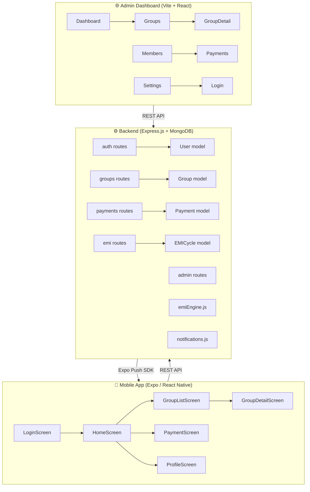

# EMI Group Finance App — Complete Codebase Analysis & Feature Plan

---

## 📐 Architecture Overview

---

## 📁 File-by-File Breakdown

### Mobile App (`mobile/`)

| File | Purpose | Status |
|------|---------|--------|
| [App.js](file:///c:/Users/amarn/OneDrive/Desktop/Android%20App/mobile/App.js) | Root component, wraps AuthProvider + Navigator | ✅ Complete |
| [app.json](file:///c:/Users/amarn/OneDrive/Desktop/Android%20App/mobile/app.json) | Expo config — name, slug, permissions, plugins | ⚠️ Missing EAS `projectId` |
| [eas.json](file:///c:/Users/amarn/OneDrive/Desktop/Android%20App/mobile/eas.json) | EAS Build profiles (dev, preview, production) | ✅ Complete |
| [privacy-policy.html](file:///c:/Users/amarn/OneDrive/Desktop/Android%20App/mobile/privacy-policy.html) | Privacy policy for Play Store | ✅ Complete |

#### Screens

| Screen | Lines | Features | Gaps |
|--------|-------|----------|------|
| [LoginScreen.js](file:///c:/Users/amarn/OneDrive/Desktop/Android%20App/mobile/src/screens/LoginScreen.js) | 190 | OTP-based phone auth, animated UI | ✅ None |
| [HomeScreen.js](file:///c:/Users/amarn/OneDrive/Desktop/Android%20App/mobile/src/screens/HomeScreen.js) | 178 | Stats cards (groups, active, pot), quick actions, active groups list | ❌ No upcoming EMI due, no next draw info, no reminders |
| [GroupListScreen.js](file:///c:/Users/amarn/OneDrive/Desktop/Android%20App/mobile/src/screens/GroupListScreen.js) | 73 | Simple list of groups with GroupCard | ✅ Functional |
| [GroupDetailScreen.js](file:///c:/Users/amarn/OneDrive/Desktop/Android%20App/mobile/src/screens/GroupDetailScreen.js) | 192 | Progress ring, pot/EMI stats, current cycle winner, member list | ❌ No "Next member for draw" info, no payment history  |
| [PaymentScreen.js](file:///c:/Users/amarn/OneDrive/Desktop/Android%20App/mobile/src/screens/PaymentScreen.js) | 190 | UPI deeplink payment, pending/completed lists | ❌ No payment gateway options (Razorpay/PhonePe SDK), only UPI deeplink |
| [ProfileScreen.js](file:///c:/Users/amarn/OneDrive/Desktop/Android%20App/mobile/src/screens/ProfileScreen.js) | 250 | Edit name, avatar, push token registration | ✅ Complete |

#### Components

| Component | Purpose | Status |
|-----------|---------|--------|
| [Avatar.js](file:///c:/Users/amarn/OneDrive/Desktop/Android%20App/mobile/src/components/Avatar.js) | Profile avatar with initials fallback | ✅ |
| [GroupCard.js](file:///c:/Users/amarn/OneDrive/Desktop/Android%20App/mobile/src/components/GroupCard.js) | Group card for list view | ✅ |
| [MemberCard.js](file:///c:/Users/amarn/OneDrive/Desktop/Android%20App/mobile/src/components/MemberCard.js) | Member row with payment status + winner badge | ✅ |
| [PaymentCard.js](file:///c:/Users/amarn/OneDrive/Desktop/Android%20App/mobile/src/components/PaymentCard.js) | Payment entry display | ✅ |
| [ProgressRing.js](file:///c:/Users/amarn/OneDrive/Desktop/Android%20App/mobile/src/components/ProgressRing.js) | SVG circular progress ring | ✅ |

#### Services

| File | Purpose | Status |
|------|---------|--------|
| [api.js](file:///c:/Users/amarn/OneDrive/Desktop/Android%20App/mobile/src/services/api.js) | Axios instance with JWT interceptors, all API calls | ⚠️ `API_BASE` hardcoded to local IP (needs env config for production) |

---

### Backend (`backend/`)

#### Models

| Model | Fields | Status |
|-------|--------|--------|
| [User.js](file:///c:/Users/amarn/OneDrive/Desktop/Android%20App/backend/src/models/User.js) | name, phone, email, avatar, role, expoPushToken, otp | ✅ |
| [Group.js](file:///c:/Users/amarn/OneDrive/Desktop/Android%20App/backend/src/models/Group.js) | name, pot/emi/reducedEmi, monthlyConfig[], members[], currentMonth, totalMonths, status | ✅ |
| [Payment.js](file:///c:/Users/amarn/OneDrive/Desktop/Android%20App/backend/src/models/Payment.js) | user, group, month, amount, status (pending/paid/verified/failed), UPI refs | ✅ |
| [EMICycle.js](file:///c:/Users/amarn/OneDrive/Desktop/Android%20App/backend/src/models/EMICycle.js) | group, month, winner, emi/reduced/pot amounts, status | ✅ |

#### Routes

| Route File | Endpoints | Status |
|------------|-----------|--------|
| [auth.js](file:///c:/Users/amarn/OneDrive/Desktop/Android%20App/backend/src/routes/auth.js) | send-otp, verify-otp, profile, me | ✅ |
| [groups.js](file:///c:/Users/amarn/OneDrive/Desktop/Android%20App/backend/src/routes/groups.js) | CRUD groups, add/remove members, monthly-config | ✅ |
| [payments.js](file:///c:/Users/amarn/OneDrive/Desktop/Android%20App/backend/src/routes/payments.js) | initiate, verify, group payments, user payments, pending/all | ✅ |
| [emi.js](file:///c:/Users/amarn/OneDrive/Desktop/Android%20App/backend/src/routes/emi.js) | create cycle, get cycles, get current cycle | ✅ |
| [admin.js](file:///c:/Users/amarn/OneDrive/Desktop/Android%20App/backend/src/routes/admin.js) | dashboard stats, users CRUD, role management, bulk notify, backup | ✅ |

#### Utilities

| File | Purpose | Status |
|------|---------|--------|
| [emiEngine.js](file:///c:/Users/amarn/OneDrive/Desktop/Android%20App/backend/src/utils/emiEngine.js) | calculateMonthlyDues, calculatePotTotal, getGroupSummary, validateGroupConfig | ✅ |
| [notifications.js](file:///c:/Users/amarn/OneDrive/Desktop/Android%20App/backend/src/utils/notifications.js) | sendPushNotification, sendBulkNotifications (Expo Push SDK) | ✅ — but **no scheduled/cron reminder system** |

---

### Admin Dashboard (`admin/`)

| Page | Features | Status |
|------|----------|--------|
| [Dashboard.jsx](file:///c:/Users/amarn/OneDrive/Desktop/Android%20App/admin/src/pages/Dashboard.jsx) | Stats cards, pending/verified counts, recent payments, group progress bars | ⚠️ Basic — needs charts, trends, revenue analytics |
| [Groups.jsx](file:///c:/Users/amarn/OneDrive/Desktop/Android%20App/admin/src/pages/Groups.jsx) | Group list with create modal | ✅ |
| [GroupDetail.jsx](file:///c:/Users/amarn/OneDrive/Desktop/Android%20App/admin/src/pages/GroupDetail.jsx) | Members, cycles, config, monthly config, add member, new cycle | ✅ |
| [Members.jsx](file:///c:/Users/amarn/OneDrive/Desktop/Android%20App/admin/src/pages/Members.jsx) | User list with search | ✅ |
| [Payments.jsx](file:///c:/Users/amarn/OneDrive/Desktop/Android%20App/admin/src/pages/Payments.jsx) | Payment list with verify/reject | ✅ |
| [Settings.jsx](file:///c:/Users/amarn/OneDrive/Desktop/Android%20App/admin/src/pages/Settings.jsx) | Backup, bulk notify | ✅ |
| [Login.jsx](file:///c:/Users/amarn/OneDrive/Desktop/Android%20App/admin/src/pages/Login.jsx) | OTP-based admin login | ✅ |

---

## ❌ Missing Features (Gap Analysis)

### 1. 📊 Dashboard Enhancement (Admin)
**Current state**: Basic stats cards + recent payments table + progress bars.  
**Missing**:
- Revenue trend charts (daily/weekly/monthly collection)
- Payment completion rate visualizations
- Overdue payment alerts
- Group health indicators (% members paid on time)
- Quick action buttons (send reminder, create cycle)

### 2. 💳 Payment Options (Mobile)
**Current state**: Only UPI deeplink (`upi://pay?...`) which opens UPI apps.  
**Missing**:
- No in-app payment status confirmation (relies on user honouring the deeplink)
- No Razorpay / PhonePe SDK integration for seamless in-app payment
- No bank transfer / NEFT option
- No cash payment recording by members
- No payment receipt/screenshot upload

### 3. 🔔 Reminders — Before & After EMI Due (Backend + Mobile)
**Current state**: Notifications only sent at cycle creation time.  
**Missing**:
- **No scheduled reminder system** (cron/job scheduler)
- No "before due date" reminder (e.g., 3 days before, 1 day before)
- No "after due date" overdue reminder (e.g., 1 day overdue, 3 days overdue)
- No reminder preferences per user
- No due date field on Group or EMICycle models
- No admin UI to configure reminder timing

### 4. 🎰 BC Draw — Next Member Should Know (Mobile + Backend)
**Current state**: Only shows current month's winner. No info about who is **eligible** for the next draw.  
**Missing**:
- No list of members who **haven't won yet** (eligible for next draw)
- No "Next Draw" section on GroupDetailScreen
- No draw order/sequence tracking
- No notification to eligible members before a draw
- No draw history timeline view

---

## 🛠️ Implementation Prompts

Below are the **detailed prompts** you can use to implement each missing feature:

---

### Prompt 1: Enhanced Admin Dashboard

> **Implement an enhanced Admin Dashboard with charts and analytics for the EMI Group Finance app.**
>
> **Context**: The admin dashboard is at [admin/src/pages/Dashboard.jsx](file:///c:/Users/amarn/OneDrive/Desktop/Android%20App/admin/src/pages/Dashboard.jsx). It currently shows basic stat cards (total groups, active groups, total members, collected amount), pending/verified payment counts, a recent payments table, and group progress bars.
>
> **Requirements**:
> 1. Add a **Revenue Trend Chart** — line chart showing daily/weekly collection amounts for the last 30 days. Add a backend endpoint `GET /api/admin/analytics/revenue?range=30d` that aggregates `Payment.aggregate()` by date for verified payments.
> 2. Add a **Payment Completion Rate** pie/donut chart showing pending vs paid vs verified vs failed breakdown.
> 3. Add **Overdue Alerts** section — list members who have `pending` payments older than 7 days. Backend: `GET /api/admin/analytics/overdue`.
> 4. Add **Group Health Cards** — for each active group, show % of members who paid on time this month.
> 5. Add **Quick Action Buttons** — "Send Reminder" (calls `/api/admin/notify`), "Create Next Cycle" (navigates to group).
> 6. Use a lightweight charting library like **Chart.js** or **Recharts** (install `recharts` via npm).
>
> **Files to modify**:
> - [backend/src/routes/admin.js](file:///c:/Users/amarn/OneDrive/Desktop/Android%20App/backend/src/routes/admin.js) — add `/analytics/revenue` and `/analytics/overdue` endpoints
> - [admin/src/services/api.js](file:///c:/Users/amarn/OneDrive/Desktop/Android%20App/admin/src/services/api.js) — add `getRevenueAnalytics()` and `getOverduePayments()` 
> - [admin/src/pages/Dashboard.jsx](file:///c:/Users/amarn/OneDrive/Desktop/Android%20App/admin/src/pages/Dashboard.jsx) — add chart components and overdue alerts section
>
> **Design**: Use the existing dark theme (`--bg-card`, `--border`, `--accent` CSS vars). Charts should use colors `#e94560`, `#00b894`, `#6c5ce7`, `#f0a500`.

---

### Prompt 2: Multiple Payment Options (Mobile)

> **Add multiple payment options to the EMI Group mobile app — UPI, Bank Transfer, Cash, and Payment Receipt Upload.**
>
> **Context**: The payment screen is at [mobile/src/screens/PaymentScreen.js](file:///c:/Users/amarn/OneDrive/Desktop/Android%20App/mobile/src/screens/PaymentScreen.js). Currently it only supports UPI deeplink via `Linking.openURL('upi://pay?...')`. The [Payment](file:///c:/Users/amarn/OneDrive/Desktop/Android%20App/mobile/src/screens/PaymentScreen.js#12-152) model already has a `paymentMethod` enum (`upi`, `bank`, `cash`, `other`).
>
> **Requirements**:
> 1. **Payment Method Selection** — When user taps "PAY", show a bottom sheet/modal with options:
>    - 💳 **UPI** (existing deeplink flow)
>    - 🏦 **Bank Transfer** — show admin's bank details (account name, number, IFSC) for manual transfer; allow user to enter UTR/reference number
>    - 💵 **Cash** — mark as "paid by cash" with a note; admin must verify
>    - 📸 **Upload Receipt** — user can take photo or pick from gallery as payment proof using `expo-image-picker`
> 2. Store `paymentMethod` in the payment record when calling [initiatePayment()](file:///c:/Users/amarn/OneDrive/Desktop/Android%20App/mobile/src/services/api.js#47-49).
> 3. For receipt upload, convert image to base64 and send as `receipt` field. Backend stores it (or better: use a file field).
> 4. Admin bank details should come from a new backend endpoint `GET /api/admin/bank-details` or be stored in a Settings/Config collection.
>
> **Files to modify**:
> - [mobile/src/screens/PaymentScreen.js](file:///c:/Users/amarn/OneDrive/Desktop/Android%20App/mobile/src/screens/PaymentScreen.js) — add PaymentMethodModal component
> - [mobile/src/services/api.js](file:///c:/Users/amarn/OneDrive/Desktop/Android%20App/mobile/src/services/api.js) — update [initiatePayment()](file:///c:/Users/amarn/OneDrive/Desktop/Android%20App/mobile/src/services/api.js#47-49) to send method + receipt
> - [backend/src/routes/payments.js](file:///c:/Users/amarn/OneDrive/Desktop/Android%20App/backend/src/routes/payments.js) — accept `paymentMethod` and `receipt` fields
> - [backend/src/models/Payment.js](file:///c:/Users/amarn/OneDrive/Desktop/Android%20App/backend/src/models/Payment.js) — add `receipt` field (String, base64 or URL)
>
> **Design**: Use the existing dark theme. Bottom sheet should slide up with method options as cards.

---

### Prompt 3: EMI Reminders — Before & After Due Date

> **Implement a scheduled reminder system that sends push notifications before and after EMI due dates.**
>
> **Context**: Push notifications are already working via [backend/src/utils/notifications.js](file:///c:/Users/amarn/OneDrive/Desktop/Android%20App/backend/src/utils/notifications.js) (Expo Push SDK). They are triggered only when a new EMI cycle is created. There is **no cron/scheduler** for recurring reminders.
>
> **Requirements**:
> 1. **Add `dueDate` field to Group model** — Date when EMI is due each month (e.g., 5th of each month). Also add `reminderDaysBefore` (default: [3, 1]) and `reminderDaysAfter` (default: [1, 3, 7]) arrays.
> 2. **Create a Reminder Scheduler** using `node-cron` (install via npm):
>    - Runs daily at 9:00 AM IST
>    - Queries all active groups
>    - For each group, calculate if today is a reminder day (before or after due date)
>    - Send push notifications to all members with pending payments
> 3. **Before due date reminder**: "⏰ EMI Reminder: Your EMI of ₹{amount} for {groupName} is due in {X} days. Pay now to avoid late fees."
> 4. **After due date (overdue) reminder**: "🚨 Overdue: Your EMI of ₹{amount} for {groupName} was due {X} days ago. Please pay immediately."
> 5. **Admin can configure** reminder days from admin dashboard Settings page.
> 6. **Track sent reminders** — create a `Reminder` model or add a `lastReminderSent` field to avoid duplicate notifications.
>
> **New files**:
> - `backend/src/jobs/reminderScheduler.js` — cron job logic
> - `backend/src/models/Reminder.js` (optional) — track sent reminders
>
> **Files to modify**:
> - [backend/src/models/Group.js](file:///c:/Users/amarn/OneDrive/Desktop/Android%20App/backend/src/models/Group.js) — add `dueDate`, `reminderDaysBefore`, `reminderDaysAfter`
> - [backend/src/server.js](file:///c:/Users/amarn/OneDrive/Desktop/Android%20App/backend/src/server.js) — import and start the scheduler
> - [backend/package.json](file:///c:/Users/amarn/OneDrive/Desktop/Android%20App/backend/package.json) — add `node-cron` dependency
> - [admin/src/pages/Settings.jsx](file:///c:/Users/amarn/OneDrive/Desktop/Android%20App/admin/src/pages/Settings.jsx) — add reminder configuration UI
>
> **Important**: The scheduler should gracefully handle timezone (IST = UTC+5:30). Use `node-cron` pattern: `'0 3 * * *'` (3:30 UTC = 9:00 AM IST).

---

### Prompt 4: BC Draw — Next Member Notification & Eligible List

> **Add "Next Draw" information showing which members are eligible for the pot and notify them before draws.**
>
> **Context**: The EMI cycle system ([backend/src/routes/emi.js](file:///c:/Users/amarn/OneDrive/Desktop/Android%20App/backend/src/routes/emi.js)) creates cycles with a `winner`. The code already checks `EMICycle.findOne({ group, winner: winnerId })` to prevent double wins. But the mobile app doesn't show who's eligible for the next draw.
>
> **Requirements**:
> 1. **Backend: Add `GET /api/emi/eligible/:groupId`** endpoint that:
>    - Finds all EMI cycles for the group (to get past winners)
>    - Returns members who **haven't won yet** as the eligible list
>    - Returns the count of remaining draws
>    - Returns members sorted by join order or a configurable draw order
> 2. **Mobile: Update [GroupDetailScreen.js](file:///c:/Users/amarn/OneDrive/Desktop/Android%20App/mobile/src/screens/GroupDetailScreen.js)** to show:
>    - A "🎯 Next Draw" section below the current winner section
>    - Show "Eligible for next pot: {count} members" with their names/avatars
>    - Highlight with a badge if the current user is eligible
>    - A "Draw History" timeline showing month-by-month winners
> 3. **Notification: When admin creates a new cycle**, send a notification to the **next eligible members** (all who haven't won):
>    - "🎰 Draw Coming Soon: You are eligible for the next pot draw in {groupName}! {X} members remaining."
>    - This notification should go out 1 day before the draw (requires knowing draw date, or immediately when admin triggers "New Cycle")
> 4. **Admin: Update [GroupDetail.jsx](file:///c:/Users/amarn/OneDrive/Desktop/Android%20App/admin/src/pages/GroupDetail.jsx)** — in the "New Cycle" modal, show the list of eligible (non-winner) members as the dropdown options (filter out past winners from selection).
>
> **Files to modify**:
> - [backend/src/routes/emi.js](file:///c:/Users/amarn/OneDrive/Desktop/Android%20App/backend/src/routes/emi.js) — add `/eligible/:groupId` endpoint, update cycle creation to notify eligible members
> - [mobile/src/services/api.js](file:///c:/Users/amarn/OneDrive/Desktop/Android%20App/mobile/src/services/api.js) — add `getEligibleMembers(groupId)` function
> - [mobile/src/screens/GroupDetailScreen.js](file:///c:/Users/amarn/OneDrive/Desktop/Android%20App/mobile/src/screens/GroupDetailScreen.js) — add NextDraw section + DrawHistory timeline
> - [admin/src/pages/GroupDetail.jsx](file:///c:/Users/amarn/OneDrive/Desktop/Android%20App/admin/src/pages/GroupDetail.jsx) — filter past winners from cycle creation dropdown
> - [admin/src/services/api.js](file:///c:/Users/amarn/OneDrive/Desktop/Android%20App/admin/src/services/api.js) — add `getEligibleMembers(groupId)` function

---

## 🚀 Play Store Deployment Checklist

Based on the existing [DEPLOYMENT_GUIDE.md](file:///c:/Users/amarn/OneDrive/Desktop/Android%20App/DEPLOYMENT_GUIDE.md), here's what needs to be done **before submitting**:

### Pre-Deployment Fixes Required

| # | Task | File(s) | Priority |
|---|------|---------|----------|
| 1 | Update `API_BASE` to production URL (currently hardcoded to `10.22.231.66:5000`) | [mobile/src/services/api.js](file:///c:/Users/amarn/OneDrive/Desktop/Android%20App/mobile/src/services/api.js) | 🔴 Critical |
| 2 | Set real `projectId` in [app.json](file:///c:/Users/amarn/OneDrive/Desktop/Android%20App/mobile/app.json) (currently `"your-eas-project-id"`) | [mobile/app.json](file:///c:/Users/amarn/OneDrive/Desktop/Android%20App/mobile/app.json) | 🔴 Critical |
| 3 | Deploy backend to Render.com and get production URL | `backend/` | 🔴 Critical |
| 4 | Set up MongoDB Atlas (free M0 cluster) | — | 🔴 Critical |
| 5 | Deploy admin dashboard to Vercel | `admin/` | 🟡 Important |
| 6 | Host privacy policy at public URL | [mobile/privacy-policy.html](file:///c:/Users/amarn/OneDrive/Desktop/Android%20App/mobile/privacy-policy.html) | 🔴 Critical |
| 7 | Create app icon (512×512), feature graphic (1024×500), screenshots | `mobile/assets/` | 🔴 Critical |
| 8 | Configure Google Play Console store listing | — | 🔴 Critical |
| 9 | Generate production AAB via EAS Build | — | 🔴 Critical |
| 10 | Complete content rating questionnaire (Finance, 18+) | — | 🟡 Important |

### Feature Priority for v1.0 Release

| Priority | Feature | Effort |
|----------|---------|--------|
| 🔴 Must-have | Fix `API_BASE` + deploy backend | 1 hour |
| 🔴 Must-have | BC Draw eligible member list | 4-6 hours |
| 🟡 Should-have | Payment method selection (UPI + Bank + Cash) | 4-6 hours |
| 🟡 Should-have | EMI reminders (cron + notifications) | 6-8 hours |
| 🟢 Nice-to-have | Enhanced dashboard with charts | 4-6 hours |

---

## 📊 Current Code Statistics

| Component | Files | Total Lines | Dependencies |
|-----------|-------|-------------|-------------|
| Mobile | 14 source files | ~1,400 lines | Expo 52, React Native 0.76, React Navigation 6, Axios |
| Backend | 12 source files | ~900 lines | Express, Mongoose, expo-server-sdk, jsonwebtoken, bcrypt |
| Admin | 10 source files | ~800 lines | Vite, React, React Router, Axios |
| **Total** | **36 source files** | **~3,100 lines** | — |
